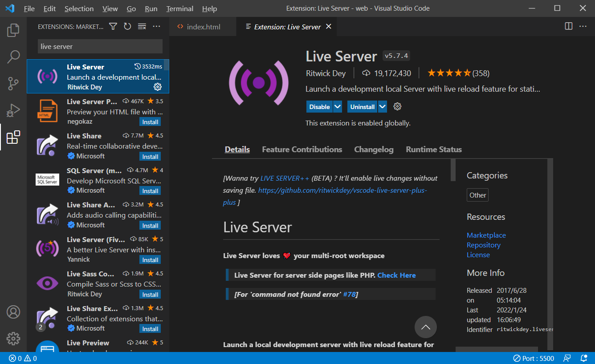
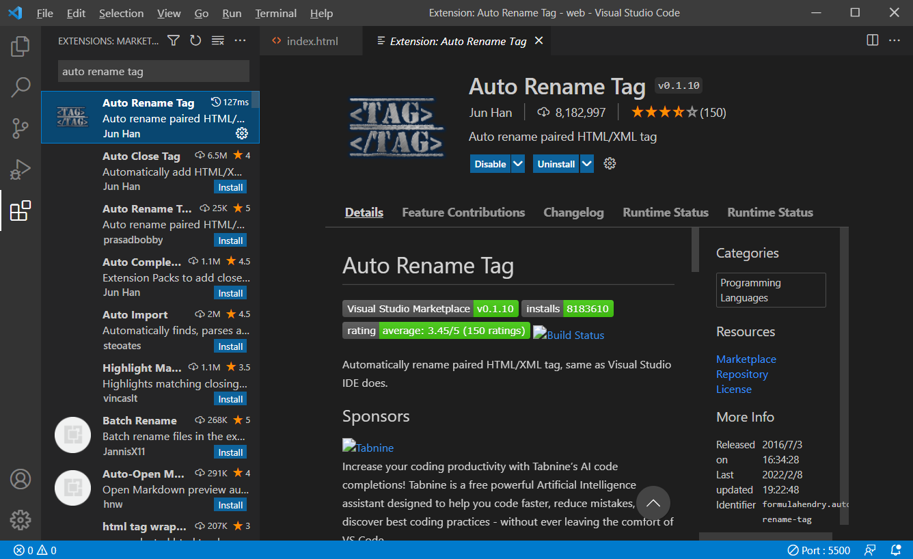
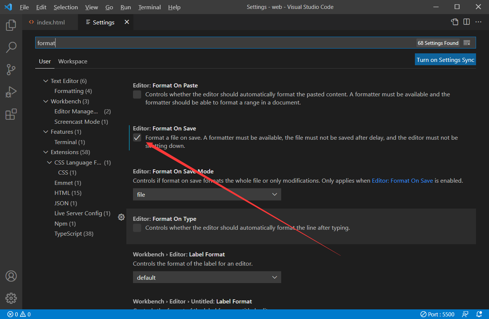

# **1.1 vscode的安装与配置**

导航：[1. html基础标签](../1. html基础标签)

---

**1.下载地址**
https://code.visualstudio.com/

**2.安装插件**

* `Live Server`

* `Auto Rename Tag`

**3.自动格式化**

* 点击`settings`，然后输入`format`，然后勾选上`Format On Save`。

